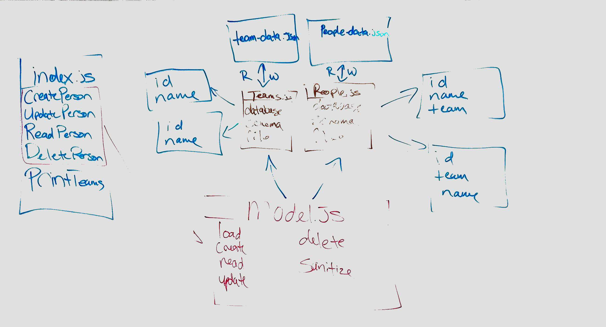

# LAB - 04

## Async

### Author: James Dunn

### Links and Resources

- [submission PR](https://github.com/james-401-advanced-javascript/lab-04/pull/1)
- [travis](https://travis-ci.com/james-401-advanced-javascript/lab-04)
- [front-end](https://jamesdunn-lab-04.herokuapp.com)

#### Documentation

- [jsdoc](https://jamesdunn-lab-04.herokuapp.com/docs)

### Modules

#### `model.js`

#### `people.js`

#### `teams.js`

#### `validator.js`

##### Exported Values and Methods

###### `create`

###### `read`

###### `update`

###### `delete`

###### `sanitize`

### Setup

#### `.env` requirements

- `PORT` - 3000

#### Running the app

- `npm start`
- Endpoint: `index.js`

  - Reads and writes to and from json file.

#### Tests

- How do you run tests?
- `npm test`

#### UML

